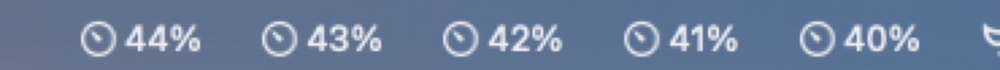
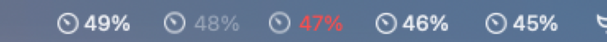
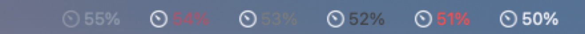
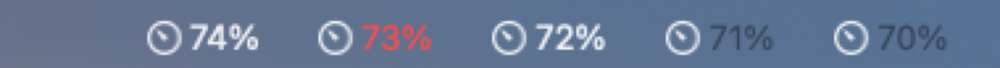
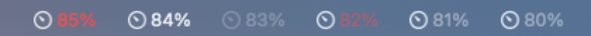
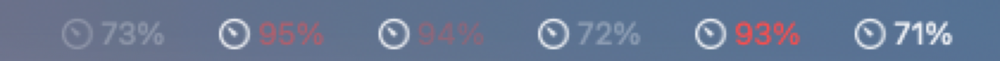
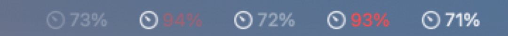
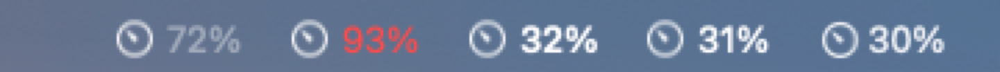
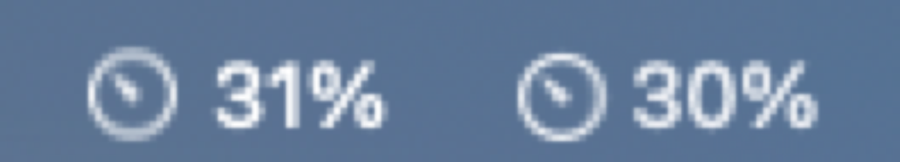
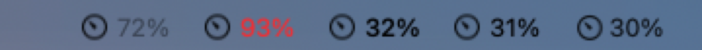

# Can the menu bar item show a red or dimmed percentage?

Findings for the ticket [Can the menu bar item show a red or dimmed percentage?](https://github.com/chris-metz/pacemark/issues/17). Measured on 2026-10-03 on macOS 27.0.1 (26A434), Xcode 27.0, Swift 6.4, in the real menu bar of an external 1× display (DELL AW2523HF). The built-in display hid the probe items in the menu bar overflow, so all screenshots come from the external display.

## Short answer

**No, not with `Image` plus `Text` in the `MenuBarExtra` label.** SwiftUI drops every colour and opacity modifier on the `Text`. The status bar button always gets a plain `title` whose attributed form says `controlTextColor`.

**The simplest route that works keeps `MenuBarExtra`:** the label is a single **non-template `NSImage` drawn at draw time** (glyph plus percentage), passed as `Image(nsImage:)`. SwiftUI hands the image through untouched (`isTemplate=false`, `NSCustomImageRep`). In the real menu bar it looks like the system label, and red, dimmed and dimmed red all show as intended.

A custom `NSStatusItem` with an `attributedTitle` also works (`systemRed` and a dynamic dim colour verified). But then the app has to present the dropdown itself through macOS 27's `expandedInterfaceDelegate`, which ADR 0002 picked `MenuBarExtra` to avoid.

## How it was tested

The probe is a SwiftPM executable (`menu-bar-label/probe/`). Each run puts up to six status items in the menu bar, each with its own percentage so it can be told apart. After 2.5 s the app dumps its own `NSStatusBarWindow`s: for each `NSStatusBarButton` it prints title, attributed title attributes, image (size, `isTemplate`, rep class), `appearsDisabled`, effective appearance and accessibility title. Then `screencapture` grabs the real menu bar. `probe/sample.swift` measures the peak brightness of text and glyph against the menu bar background, as an "implied white alpha".

```sh
cd docs/research/menu-bar-label/probe && swift build
.build/debug/LabelProbe s1     # batches: s1 s2 a a2 a3 a4 a5 c ax h
FORCE_LIGHT=1 .build/debug/LabelProbe c   # force .vibrantLight on the status windows
```

The menu bar on this machine is `NSAppearanceNameVibrantDark` even with the system in Light mode: on macOS 27 the transparent menu bar follows the wallpaper (here the default one), not the system appearance. See [Light menu bar](#light-menu-bar).

## Results

### SwiftUI `MenuBarExtra` label: every colour and opacity modifier is dropped

SwiftUI turns `HStack { Image(systemName:); Text(_:) }` into one `NSStatusBarButton` with `image` (15×15 `NSSymbolImageRep`, template) and `title`. The attributed title always carries `NSColor = controlTextColor`, whatever the `Text` says.

| Item | Label | Button | Menu bar |
|---|---|---|---|
| 40 | `Text("40%")` (baseline) | title, `controlTextColor` | white |
| 41 | `.foregroundStyle(.red)` | same | white |
| 42 | `.foregroundColor(.red)` | same | white |
| 43 | `Text(AttributedString)` with `foregroundColor = .red` | same | white |
| 44 | `.opacity(0.4)` | same | white |
| 45 | `.foregroundStyle(.secondary)` | same | white |
| 46 | `.foregroundStyle(.red)` on the whole `HStack` | same | white |
| 49 | `.foregroundStyle(Color(nsColor: .tertiaryLabelColor))` | same | white |




**Patching SwiftUI's own button does not stick.** Setting `attributedTitle` with `systemRed` on the `NSStatusBarButton` that SwiftUI created (found through `NSApp.windows`) is reset to `controlTextColor` within a second, without any label change (batch `h`, screenshot 09).

### SwiftUI label with `Image(nsImage:)`: passes through

| Item | Image | Button | Menu bar |
|---|---|---|---|
| 47 | non-template, glyph in `labelColor`, text in `systemRed` | `isTemplate=false`, `NSCustomImageRep` | red text; glyph greyish |
| 48 | template, text at alpha 0.4 | `isTemplate=true` | dimmed text; glyph and text thinner and greyer than the system label |

`labelColor` drawn into an image renders grey on the vibrant menu bar, because it is meant for vibrancy blending. A template image can be dimmed but never red. Mixing template images (normal, dimmed) with a non-template image (red) would change the glyph's look between states.

### Custom `NSStatusItem` with `attributedTitle`

Template glyph as `button.image`, `.imageLeading`, attributed title with `NSFont.menuBarFont(ofSize: 0)` (= system font 13 pt):

| Item | Title colour | Menu bar |
|---|---|---|
| 50 | plain `title` (baseline) | white |
| 51 | `systemRed` | **clean red, same weight as the baseline** ✓ |
| 52 | `tertiaryLabelColor` | dark, darker than the background ✗ |
| 53 | `secondaryLabelColor` | dark grey, low contrast ✗ |
| 54 | `systemRed.withAlphaComponent(0.5)` | muted red ✓ (resolved eagerly to a static colour) |
| 55 | `appearsDisabled = true` | glyph **and** text dimmed (system disabled look) |
| 70 | `labelColor.withAlphaComponent(0.4)` | black: resolved eagerly against the app's light appearance ✗ |
| 71 | `controlTextColor.withAlphaComponent(0.4)` | black, same reason ✗ |
| 72 | `disabledControlTextColor` | full white, not dimmed ✗ |
| 73, 74 | `highlight(true)` | no visible change on macOS 27 |
| 80 | dynamic: `labelColor` resolved in the drawing appearance, alpha 0.4 | dimmed, glyph stays bright ✓ |
| 82 | dynamic: `systemRed` resolved in the drawing appearance, alpha 0.5 | muted red ✓ |

"Dynamic" is `NSColor(name: nil) { appearance in … }` that resolves the base colour inside `appearance.performAsCurrentDrawingAppearance` and then applies the alpha, so it is resolved at draw time against the menu bar's appearance.





### How dim is "dimmed like a disabled item"?

Implied white alpha against the menu bar background (dark menu bar):

| What | Text | Glyph |
|---|---|---|
| System title / template glyph (baseline) | 0.90 | 0.89 |
| `appearsDisabled` (system disabled look) | 0.27 | 0.27 |
| Dynamic colour at alpha 0.4 | 0.42 | (stays 0.89) |

At the system's disabled level (0.3), a dimmed **red** barely reads as red on a blue wallpaper; at 0.5 it reads as a muted red (screenshot 06: 94 at 0.3, 95 at 0.5). **Alpha 0.4 for both** keeps the white clearly dimmed and the red recognisable, so one constant covers both (screenshot 07: 71 normal, 93 red, 72 dimmed, 94 dimmed red, 73 `appearsDisabled` for reference).




### The whole label drawn as one image (the route that works)

Batch `c`: `MenuBarExtra` with `Image(nsImage: DrawnLabel.make(…))`. The image comes from `NSImage(size:flipped:drawingHandler:)` with `isTemplate = false`. Inside the handler, dark or light comes from `NSAppearance.currentDrawing().bestMatch(from: [.aqua, .darkAqua, .vibrantLight, .vibrantDark])`. The foreground is plain white (dark) or black (light). The glyph is `gauge.with.needle` at its default size (15×15) tinted with `paletteColors: [foreground]`, followed by a 4 pt gap and the text in the 13 pt system font.

| Item | Label | Text | Glyph |
|---|---|---|---|
| 30 | system label `Image` + `Text` (reference) | 0.90 | 0.89 |
| 31 | drawn, regular weight | 1.00 | 0.90 |
| 32 | drawn, medium weight | 1.00 | — (visibly bolder than the system label) |
| 93 | drawn, text `systemRed` | red | as 31 |
| 72 | drawn, text at alpha 0.4 | 0.43 | as 31 |

Regular weight matches the system label. Pure white text is about 10 % brighter than the system's vibrant white, which is hard to see at real size (screenshot 08, zoom). The drawn item is 61 pt wide against 67 pt for the system label.




**Appearance changes redraw it.** With `.vibrantLight` forced on the status windows after launch, the drawn glyph and text switch to black, the dimmed text to dark grey and the red to the light `systemRed`:



**Accessibility (batch `ax`):** `NSImage.accessibilityDescription` becomes the button's `accessibilityTitle()`. SwiftUI's `.accessibilityLabel(_:)` on the label `Image` is dropped (`nil`). The system label exposes title "35%" and image description "Gauge with a needle".

## Light menu bar

A real light menu bar was **not** captured. On macOS 27 the menu bar's appearance follows the wallpaper: here it is `VibrantDark` in Light mode, and the default wallpaper is dark in Dark mode too. A borderless window placed behind the menu bar (frame overlapping it, `constrainFrameRect` overridden) does not show through: the menu bar keeps showing the wallpaper. Changing the user's wallpaper was out of bounds for this run.

As a stand-in, `FORCE_LIGHT=1` sets `.vibrantLight` on the probe's status windows (on the dark wallpaper). Every route then resolves its light variants: black glyph and text, dark grey dimmed text, light `systemRed` (screenshots 05, 07, 08 "forced light"). The contrast against a real light background is unverified.

## Not checked

- The open dropdown's highlight: `highlight(true)` has no visible effect on macOS 27, consistent with the stack research (`button?.highlight(true)` no longer works).
- A Retina menu bar: the built-in display hid the items in the overflow.
- Increase Contrast and Reduce Transparency.
